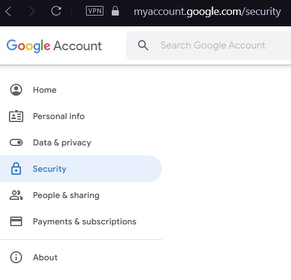
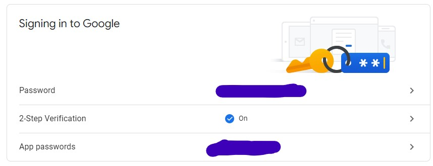
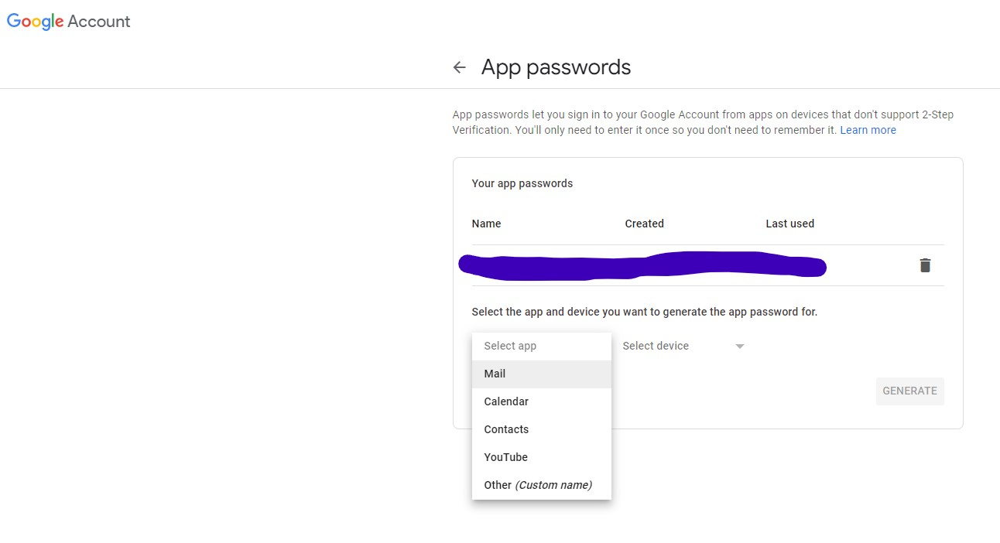
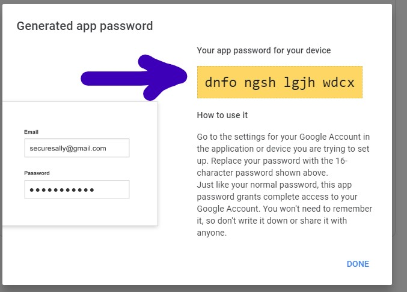

# How to send email using Google after its policy update on not allowing user password
### 1. Log in into your e-mail [account](https://myaccount.google.com/)
### 2. Go to the security part

Be sure that you have turn on two steps verification and click on "App password"

### 3. Select e-mail and the corresponding device

### 4. It will generate a password which you will use as password in your python script

